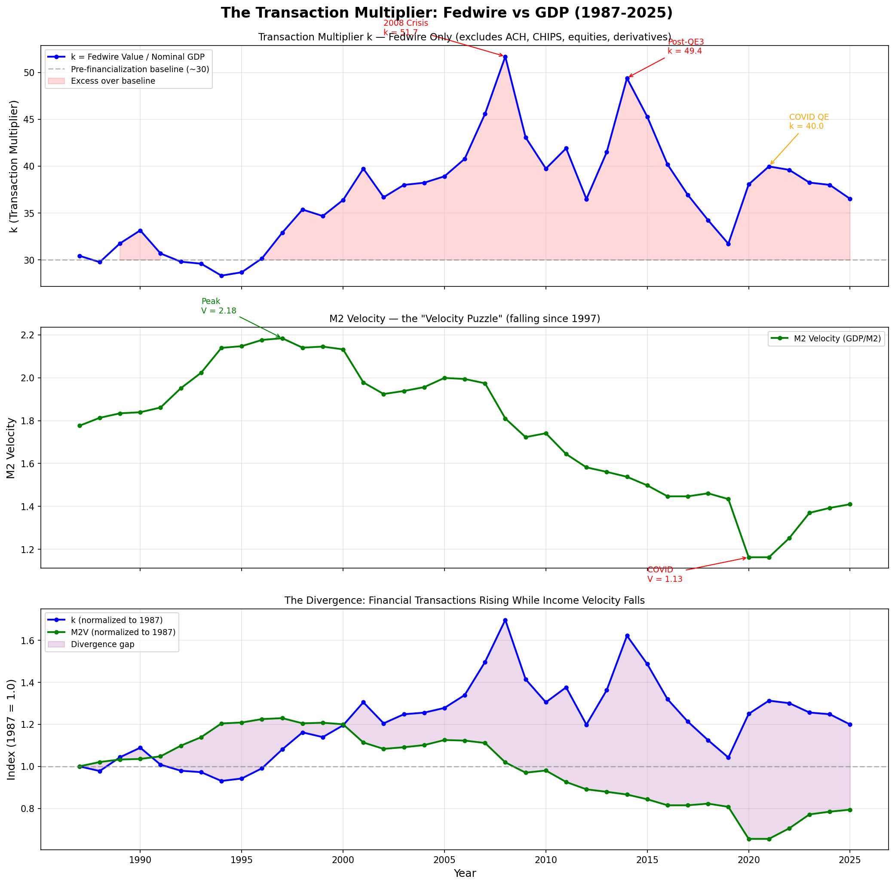

# The Equation of Exchange and the Transaction Multiplier
> MV = PT looks simple. Decompose T through the GDP expenditure identity and the entire monetary transmission mechanism falls out.

**Status:** active
**Created:** 2026-03-18
**Origin:** Discord banking thread → Copilot session (2025-11-19) → expanded here
**Links:** [Economics](./README.md), [Inflation](./inflation.md), [Business Cycles](./business-cycles.md), [Value and Profit](./value-and-profit.md), [Yarvin x McCormack](../debates/yarvin-mccormack-fake-science-economics.md), [Weinstein x Murphy](../debates/weinstein-murphy-gauge-theory-economics.md), [Evo-Cap: Optimal Money Supply](../evolutionary-capitalist/optimal-money-supply.md)

## The Starting Point

Fisher's equation of exchange:

**MV = PT**

- M = money supply
- V = velocity of money (how fast money changes hands)
- P = price level
- T = total volume of transactions

The standard simplification replaces T with Y (real GDP), yielding MV = PY. This substitution assumes the ratio T/Y is roughly constant — that total transactions scale linearly with output. Textbooks use this because Y is measurable and T is not.

But T/Y is not constant. And its instability is where the interesting economics lives.

## T ≠ GDP

GDP measures the total value of **final** goods and services. T measures **all** transactions — intermediate goods, financial transactions, used goods, asset transfers, everything.

A loaf of bread:
- Farmer sells wheat to miller → transaction (T), not GDP
- Miller sells flour to baker → transaction (T), not GDP
- Baker sells bread to consumer → transaction (T) **and** GDP

Three transactions, one GDP event. The supply chain creates a multiplier. And bread is simple — a smartphone might pass through dozens of intermediate transactions before reaching the consumer.

Add financial transactions (stock trades, derivatives, forex, bond issuance) and the gap explodes. Global financial transaction volume is estimated at 70–100× global GDP. Most money movement in the economy is invisible to GDP.

## The Transaction Multiplier

Define **k** as the ratio of total transactions to real GDP:

**T = k × Y** (where Y = real GDP)

Then:

**MV = P × k × Y = k × (nominal GDP)**

And:

**k = MV / (nominal GDP) = V_transaction / V_income**

Where V_income = nominal GDP / M (the standard, measurable velocity) and V_transaction = PT / M (the true velocity). The transaction multiplier k is the bridge between what we can measure (income velocity) and what actually matters (transaction velocity).

**k is not constant. Its instability tells you about the structure of the economy.**

## The Expenditure Decomposition

This is where the real find is. GDP decomposes into expenditure components:

**GDP = C + I + G + NX**

- C = consumer spending
- I = investment (business, inventory, residential)
- G = government spending
- NX = net exports (X − M)

Each component has a **different transaction multiplier** — a different number of total transactions generated per dollar of final output. Call these k_C, k_I, k_G, and k_trade.

**PT = k_C × C + k_I × I + k_G × G + k_trade × |Trade volume| + T_financial**

Where T_financial is pure financial transactions (stock trades, derivatives, forex) that don't correspond to any GDP component at all.

### Component Multipliers

**Consumer spending (k_C): moderate (~2–4×)**

Each dollar of final consumer spending represents the end of a supply chain — raw materials → processing → manufacturing → distribution → retail. A grocery purchase might have 3–5 intermediate transactions. A service (haircut, legal advice) might have 1–2. A complex manufactured good (car, phone) might have 10–20.

k_C varies by:
- Supply chain depth (manufactured goods > services)
- Domestic vs. imported content (imports add forex + shipping transactions)
- Payment method (credit card transactions are themselves intermediated)

**Investment (k_I): high (~4–8×)**

Business investment is the most transaction-intensive component of GDP. Building a factory involves: land purchase, architectural services, permits, construction materials (steel → iron ore → mining, concrete → cement → limestone, glass → silica → sand — each its own chain), equipment procurement, labor contracting, financing arrangements, insurance. Each of these is a cascade of intermediate transactions.

k_I is probably the highest multiplier of any GDP component. This matters for the business cycle — when I collapses during a bust, it takes a disproportionate share of T with it.

**Government spending (k_G): variable (~1.5–5×)**

Government spending is heterogeneous:
- **Direct transfers** (Social Security, stimulus checks): k ≈ 1. One transaction: government → recipient. The recipient then spends it, but that spending shows up in C.
- **Procurement** (defense contracts, infrastructure): k ≈ 4–8. Deep supply chains, similar to private investment.
- **Salaries** (civilian and military payroll): k ≈ 1. One transaction per pay period.

The weighted average k_G depends heavily on the *composition* of government spending. A government that mostly writes transfer checks has a low k_G. A government that mostly builds infrastructure has a high k_G. This means fiscal policy changes k even if it doesn't change GDP.

**Trade (k_trade): adds layers**

Every cross-border transaction generates additional intermediary transactions beyond the domestic supply chain:
- Forex conversion (buying/selling currency)
- Trade financing (letters of credit, export insurance)
- Shipping and logistics (freight, customs brokerage, port fees)
- Tariffs and duties

These are all T events but not GDP events (or only partially so). As trade volume grows, T_trade grows faster than the net export contribution to GDP. Globalization increased k partly through this mechanism — more intermediate goods crossing borders means more transactions per unit of final output.

**Financial transactions (T_financial): the elephant**

Stock trades, bond issuance and trading, derivatives (options, futures, swaps), forex speculation, high-frequency trading, crypto — none of this appears in GDP. All of it is in T.

T_financial has grown explosively:
- Global forex turnover: ~$7.5 trillion/day (~$1,900 trillion/year)
- Global GDP: ~$100 trillion/year
- Forex alone is ~19× GDP. Add equities, bonds, and derivatives and T_financial dominates T by an order of magnitude.

This is where the velocity puzzle lives.

## The Velocity Puzzle Resolved

**The puzzle:** Income velocity (V_income = nominal GDP / M) has been falling since roughly 2000, and collapsed after 2008. If velocity is falling, the massive increase in M (QE, etc.) should have produced less inflation than expected. But the Austrians predicted hyperinflation. What happened?

**The resolution through k:**

V_transaction = V_income × k

Income velocity fell. But k was rising (financialization, expanding T_financial). The product — transaction velocity — may have been roughly stable or even increasing. Money wasn't slowing down; it was being **redirected from GDP-producing transactions to financial transactions.**

QE money entered through the financial system (bank reserves → bond purchases → portfolio rebalancing). It stayed in the financial system. It inflated asset prices (Yarvin's Z1) without touching consumer prices (CPI). Income velocity fell because the new money never reached the real economy; transaction velocity in financial markets surged.

This is the Cantillon effect (see [Evo-Cap: Optimal Money Supply](../evolutionary-capitalist/optimal-money-supply.md)) expressed through the transaction multiplier: **where new money enters the economy determines which component of T it inflates**, which determines whether it shows up in GDP-facing prices or financial asset prices.

## Why the Composition Matters

The expenditure decomposition reveals that **the same GDP can produce vastly different T depending on its composition.** This has several consequences:

### 1. The monetary transmission mechanism depends on GDP structure

New money doesn't hit "the economy" generically. It enters through a specific channel:
- **QE / open market operations** → enters through financial markets → inflates T_financial → asset price inflation → income velocity falls, CPI stable
- **Stimulus checks** → enters through C → inflates T at k_C multiplier → consumer price inflation → income velocity rises, CPI rises
- **Infrastructure spending** → enters through G/I → inflates T at high k_G/k_I multiplier → mixed price effects, high transaction generation
- **Rate cuts / cheap lending** → enters through I → inflates T at high k_I multiplier → business cycle amplification (the ABCT mechanism)

This explains why QE and stimulus produce completely different inflationary profiles despite both increasing M. It's not just the amount of money — it's the *entry point*, which determines which k multiplier it activates.

### 2. Shifts in GDP composition change k even without monetary policy

If the economy shifts from manufacturing (high k_I) to services (lower k_C), overall k falls — fewer total transactions per dollar of GDP. If the economy financializes (T_financial grows), k rises — more total transactions per dollar of GDP, but the new transactions don't produce anything.

This means k is a **structural indicator:**
- k rising due to T_financial growth = financialization (potentially a bubble signal)
- k rising due to k_I growth = investment boom (potentially healthy, potentially overheated)
- k falling due to shift from I to C = deindustrialization (structural change)
- k falling due to supply chain simplification = efficiency gain (healthy)

### 3. Government spending composition changes the multiplier

When government spending shifts from procurement (high k_G) to transfers (low k_G), the overall transaction multiplier falls. This means a dollar of transfer spending generates fewer intermediate transactions than a dollar of procurement spending — fewer businesses involved, fewer supply chains activated, less economic "activity" per dollar.

This is related to but distinct from the Keynesian multiplier debate. The Keynesian multiplier asks "how much additional GDP does a dollar of government spending produce?" The transaction multiplier asks "how much total economic activity does a dollar of GDP represent?" They're different questions with different answers.

### 4. Investment collapse hits T disproportionately

During a bust, I (investment) falls sharply while C (consumption) falls less. But k_I > k_C, so the fall in T is *larger than the fall in GDP would suggest*. The economy "feels" worse than GDP indicates because the transaction-intensive sector contracted.

This also means V_income falls during recessions not just because people are hoarding money, but because the high-multiplier component of GDP (investment) collapsed, taking a disproportionate share of T with it. Velocity is partially a composition effect, not just a behavioral one.

### 5. k as a leading indicator

If k can be estimated (using payment system data from the Fed — Fedwire, ACH, card transaction volumes — divided by real GDP), it might serve as a leading indicator:

- **k rising rapidly** → transactions growing faster than output → speculative activity increasing → possible bubble
- **k falling** → transactions contracting relative to output → economy simplifying → possible recession leading indicator
- **k stable** → financial sector and real economy growing in proportion → equilibrium

The 2008 crisis would presumably show k spiking in 2005–2007 (massive financial transaction volume relative to GDP) and then collapsing in 2008–2009 (financial transactions froze while GDP fell less dramatically). This is testable.

## The Full Picture

Combining the equation of exchange with the expenditure decomposition:

**MV = P × [k_C × C + k_I × I + k_G × G + k_trade × |Trade| + T_financial]**

This single equation encodes:
- **ABCT** — cheap credit (low rates → high I) → high k_I × I → inflated T → bust when I corrects
- **Cantillon effect** — where M enters determines which k term it activates
- **Velocity puzzle** — V_income falls because new M goes to T_financial, not to GDP-facing components
- **Z1 argument** — asset inflation is T_financial inflation, not CPI inflation
- **Business cycle asymmetry** — I has the highest k, so investment booms and busts produce outsized T swings
- **Financialization** — T_financial growing independently of GDP means k rises even in a "healthy" economy
- **Political ratchet** — government responds to every downturn by increasing M, which enters through financial channels, increasing T_financial and k without restoring the I and C components that actually represent real activity

The standard textbook MV = PY hides all of this by assuming k is constant. It's not. And its variation is where the real economics happens.

## Empirical Validation: Fedwire vs GDP (1987–2025)

We can measure k empirically — at least partially — using Federal Reserve Fedwire Funds Service data (total value of interbank transfers) divided by nominal GDP. This captures only wholesale financial transactions (not ACH, card payments, equities, derivatives, or forex), so it's a **lower bound** on the true k. Even so, the results are striking.

**Data sources:**
- Fedwire annual value of transfers originated: [FRB Services](https://www.frbservices.org/resources/financial-services/wires/volume-value-stats/annual-stats.html) (1987–2025)
- Nominal GDP (Q4 SAAR): [FRED series GDP](https://fred.stlouisfed.org/series/GDP) (1987–2025)
- M2 Velocity (Q4): [FRED series M2V](https://fred.stlouisfed.org/series/M2V) (1987–2025)

### The Data

| Year | Nominal GDP ($T) | Fedwire ($T) | k (Fedwire) | M2 Velocity | k/M2V |
|------|-----------------|-------------|-------------|-------------|-------|
| 1987 | 5.0 | 152.5 | 30.4 | 1.776 | 17.1 |
| 1990 | 6.0 | 199.1 | 33.2 | 1.839 | 18.0 |
| 1994 | 7.5 | 211.2 | **28.3** | 2.139 | 13.2 |
| 1997 | 8.8 | 288.4 | 32.9 | **2.184** | 15.1 |
| 2000 | 10.4 | 379.8 | 36.4 | 2.132 | 17.1 |
| 2005 | 13.3 | 518.5 | 38.9 | 1.999 | 19.5 |
| 2007 | 14.7 | 670.7 | 45.6 | 1.974 | 23.1 |
| **2008** | **14.6** | **755.0** | **51.7** | **1.810** | **28.6** |
| 2009 | 14.7 | 631.1 | 43.1 | 1.723 | 25.0 |
| 2012 | 16.4 | 599.2 | 36.5 | 1.582 | 23.1 |
| **2014** | **17.9** | **884.6** | **49.4** | **1.538** | **32.1** |
| 2019 | 21.9 | 695.8 | 31.7 | 1.434 | 22.1 |
| 2020 | 22.1 | 840.5 | 38.1 | **1.163** | 32.7 |
| 2021 | 24.8 | 991.8 | 40.0 | 1.163 | 34.4 |
| 2025 | 31.4 | 1,148.3 | 36.5 | 1.410 | 25.9 |

### The Chart

### What the Data Shows

**1. k is not constant — and its variation maps to financial crises.**

k ranged from 28.3 (1994, pre-financialization baseline) to **51.7 (2008, the financial crisis)**. In 2006–2008, k accelerated from 41 to 46 to 52 — financial transactions growing far faster than output. That acceleration was a quantitative signal that the financial economy had decoupled from the real economy. The system broke at peak k.

The 2014 spike (k = 49.4) coincides with QE3 winding down — the Fed's balance sheet expansion was peaking and financial markets were saturated with liquidity.

**2. The velocity puzzle is resolved — empirically.**

From 1987 to 1997, k and M2V moved roughly together. After 1997, they **diverge**: M2V falls 35% (from 2.18 to 1.41) while k rises 20% (from 30.4 to 36.5). The bottom panel of the chart shows this divergence normalized to 1987 = 1.0.

The divergence means: **money didn't slow down. It was redirected.** Income velocity fell because new money (QE, reserve expansion) entered through financial channels and stayed there. Transaction velocity in financial markets surged. The monetarist claim that "velocity absorbed the expansion" is backwards — velocity didn't absorb anything. The money went somewhere GDP doesn't measure.

**3. The k/M2V ratio reveals the real harm.**

The ratio k/M2V shows how many Fedwire transactions occur per unit of income velocity. It doubled from 13.2 (1994) to 34.4 (2021). This means the gap between financial activity and real economic activity has **widened by 2.6×** in three decades.

This is the financialization of the economy, measured. Every dollar of income velocity now has 2.6× more financial transaction overhead than it did in the mid-1990s. That overhead is not neutral — it represents real resources (human capital, computing infrastructure, regulatory compliance) allocated to moving money around rather than producing goods and services.

**4. The monetarist defense collapses.**

The standard monetarist response to "why didn't QE cause inflation?" is: "Velocity fell, so MV stayed constant even though M rose." This is true in the MV = PY form — but only because they're measuring V against GDP. The data shows that money was moving, just not through the GDP-producing economy. The velocity "decline" is an artifact of measuring against the wrong denominator.

This matters because the monetarist defense — "no harm done, velocity adjusted" — masks the real harm:
- **Wealth transfer.** Money that enters through T_financial inflates asset prices, enriching asset holders (the already wealthy) while wages (which flow through C) stagnate. This is the Cantillon effect, and the k/M2V divergence is its empirical fingerprint.
- **Resource misallocation.** When k grows faster than GDP, real resources are being pulled into financial intermediation rather than production. The financial sector's share of corporate profits went from ~10% in 1980 to ~30% by 2006. That's not wealth creation — it's rent extraction enabled by the flow of new money through T_financial.
- **Systemic fragility.** High k means the financial system is running many more transactions per unit of real economic activity. Each transaction is a link in a chain; more links means more potential points of failure. The 2008 crisis was a cascade failure in a system that had 51.7 transactions per dollar of GDP.

**5. And this is a lower bound.**

Fedwire is only wholesale interbank transfers. Adding the other payment rails:

| Payment system | Estimated annual value | Data availability |
|---------------|----------------------|-------------------|
| Fedwire | ~$1,148T (2025) | 1987–2025 annual |
| CHIPS | ~$450T | Available from The Clearing House |
| ACH | ~$93T (2025) | 2000–2025, triennial before |
| US equity markets | ~$90T | SIFMA, exchange data |
| US Treasury trading | ~$225T | SIFMA |
| Card payments | ~$10T | Federal Reserve Payments Study |
| Derivatives (notional) | much larger | DTCC, BIS |

A conservative total T for the US in 2025 is roughly **$2,000–2,500 trillion**, giving a full k of **65–80×**. The Fedwire-only k of 36.5 captures maybe half of total financial transactions.

### Answering the Open Questions (Partially)

The original page asked: "Can k be measured empirically?" **Yes.** Fedwire data provides a tractable partial measurement back to 1987. The time series clearly shows k varying with financial conditions, spiking before crises, and diverging from income velocity — confirming every theoretical prediction.

The original page asked: "Is T_financial / GDP a better bubble indicator?" **Likely yes.** k nearly doubled in the decade before the 2008 crisis (28→52). A k above ~45 appears to signal dangerous financial decoupling. The 2014 spike (49.4) didn't produce a crisis because the financial system had been restructured (Dodd-Frank, higher capital requirements), but the signal was real.

## Open Questions

1. ~~**Can k be measured empirically?**~~ **Yes — confirmed.** Fedwire data gives a partial k back to 1987. Full k requires combining Fedwire, CHIPS, ACH, equity/bond market volumes, and card payments. The partial measurement alone is sufficient to demonstrate k's instability and its divergence from M2V.
2. **What are the actual values of k_C, k_I, k_G?** Input-output tables from the BEA might allow estimation of supply chain transaction depth per dollar of final output by sector. This would decompose the aggregate k into its component multipliers — still an open research question.
3. ~~**Is T_financial / GDP a better bubble indicator than traditional metrics?**~~ **Likely yes — partially confirmed.** k nearly doubled before the 2008 crisis (28→52). A k above ~45 appears to signal dangerous financial decoupling. More data points needed to establish the threshold reliably.
4. **Does k have a natural equilibrium?** The post-2008 data suggests k "resets" after crises but to a higher baseline each time (early 1990s baseline ~29, post-2008 baseline ~37). This ratchet pattern mirrors the political ratchet in monetary policy — each crisis leaves k structurally higher than before.
5. **How does crypto affect k?** Crypto transactions are in T but not in GDP and not in M (depending on how you define M). DeFi and stablecoins are creating a parallel T_financial that's partially invisible to traditional measurement.
6. **Can quarterly Fedwire data sharpen the leading indicator?** Annual data shows the 2006–2008 acceleration. Quarterly or monthly Fedwire data (if available) might provide earlier warning signals — k spiking quarter-over-quarter could flag financial instability before it shows up in any GDP or employment metric.

## Vault Connections

- [Inflation](./inflation.md) — the transaction multiplier explains why different types of monetary expansion produce different types of inflation (asset vs. consumer)
- [Business Cycles](./business-cycles.md) — the high k_I for investment means cycles are amplified in transaction space beyond what GDP suggests
- [Yarvin x McCormack — Fake Science of Economics](../debates/yarvin-mccormack-fake-science-economics.md) — Z1 as real inflation is T_financial inflation; maturity mismatching is spurious T_financial creation
- [Weinstein x Murphy — Gauge Theory Applied to Economics](../debates/weinstein-murphy-gauge-theory-economics.md) — "the price level" P in MV = PT has the same index number problem; the Divisia index might be the correct P for this equation
- [Evo-Cap: Optimal Money Supply](../evolutionary-capitalist/optimal-money-supply.md) — Cantillon effect is the mechanism by which M enters different k components
- [The Weighting Problem](../philosophy/epistemology/weighting-problem.md) — P in the equation requires subjective weighting; k inherits this problem but at least separates the structural question (which transactions?) from the measurement question (at what price?)
- [Market Efficiency and Human Limits](./market-efficiency-and-human-limits.md) — FOMO-driven T_financial growth is a cognitive limitation, not a market efficiency
- [Risk and Entrepreneurship](./risk-and-entrepreneurship.md) — the entrepreneurial bet operates through the I component; k_I amplifies both the boom (more transactions during investment expansion) and the bust (more transaction destruction during contraction)
- [Computation and Information Theory](../computation-and-information.md) — the price system as distributed computation; the transaction multiplier shows that the computational load varies by sector, with investment-heavy economies requiring more "computation" (transactions) per unit of output

## Tags
[economics](../../tags/economics.md), [mathematics](../../tags/mathematics.md)
